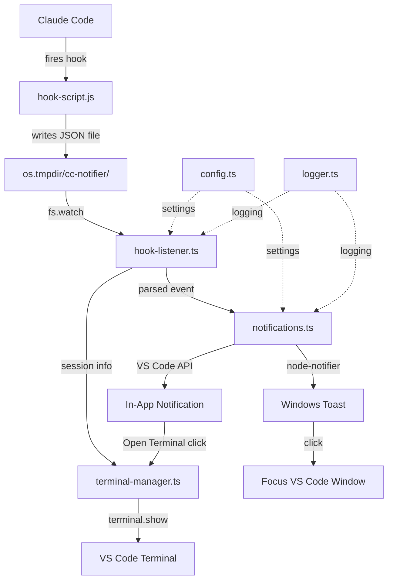

# Spec: CC-Notifier MVP

## 1. Overview

**Feature:** CC-Notifier -- Full MVP VS Code Extension
**Description:** VS Code extension that sends Windows toast notifications and in-app alerts when Claude Code is idle and waiting for user input, with automatic hook configuration, re-notification reminders, and terminal focus actions.
**Phase:** Foundation + Core (single implementation pass)
**Dependencies:** None (greenfield project)

---

## 2. Decisions from User Interview

| Topic | Decision |
|-------|----------|
| Hook installation | Automatic -- extension configures `~/.claude/settings.json` with user confirmation |
| Idle timing | Use Claude Code's default (`idle_prompt` fires at ~60s) |
| Stop events | **NOT included** -- only notify on `idle_prompt` and `permission_prompt` |
| Multiple idle sessions | Separate toast per session (simpler, more informative) |
| Re-notification | Remind at **5 minutes** and **15 minutes** after initial notification if still idle |
| Sound | Toast sound on by default, configurable toggle |
| Terminal detection | Best-effort match by `cwd` path comparison with open terminals |
| "Open Terminal" action | Focus terminal AND bring VS Code window to foreground |
| Multi-window | In-app notification only in the window owning the terminal; Windows toast always fires |
| Hook script location | Inside extension install dir, path managed by extension |
| Stale events | Clean up events older than 5 minutes on startup |
| Temp dir creation | Extension creates `os.tmpdir()/cc-notifier/` on activation |
| Corrupt event files | Log to output channel, then delete |
| Debounce window | 30-second minimum between notifications for same session |
| Toast content | Include project folder name + event type (e.g., "Claude waiting -- MyProject") |
| Toast click | Focus the specific VS Code window with the idle session |
| Status bar | **Deferred** to Polish phase (not in MVP) |
| Notification priority | `permission_prompt` uses `showWarningMessage`; `idle_prompt` uses `showInformationMessage` |
| Distribution | Manual `.vsix` install |
| Settings | All config toggles included in MVP |
| First-run | Simple prompt: "CC-Notifier: Configure Claude Code hooks?" with Yes/No |
| Logging | Two levels (verbose/minimal) with toggle, defaults to verbose |

---

## 3. Architecture

### Module Map

```
src/
  extension.ts          -- Entry point. Wires modules, registers commands, manages lifecycle.
  hook-listener.ts      -- Watches temp dir with fs.watch. Parses events, deletes files.
  notifications.ts      -- Fires Windows toast + in-app notification. Debounce + reminder logic.
  terminal-manager.ts   -- Maps session_id to VS Code terminal by cwd matching.
  config.ts             -- Reads extension settings. Provides typed config object.
  hook-installer.ts     -- Reads/writes ~/.claude/settings.json to configure hooks.
  logger.ts             -- Output channel wrapper with verbose/minimal toggle.
hook/
  hook-script.js        -- Plain JS. Reads stdin, writes event file, exits.
```

### Data Flow



### Reminder Timeline

```
Event received (idle_prompt)
  ├─ T+0s:   Initial notification (toast + in-app)
  ├─ T+5min:  First reminder (toast + in-app, if still idle)
  └─ T+15min: Final reminder (toast + in-app, if still idle)
      └─ No further reminders until user interacts or new event
```

---

## 4. Implementation Steps

### Step 1: Project Scaffolding

**Files to create:** `package.json`, `tsconfig.json`, `esbuild.mjs`, `biome.json`, `.vscodeignore`, `.vscode/launch.json`, `.vscode/tasks.json`

**package.json key fields:**
- `name`: `cc-notifier`
- `displayName`: `CC-Notifier`
- `engines.vscode`: `^1.93.0`
- `main`: `./dist/extension.js`
- `activationEvents`: `["onStartupFinished"]` (lazy -- checks for hook events dir)
- `contributes.configuration`: all settings (see Step 10)
- `contributes.commands`: `ccNotifier.configureHooks`, `ccNotifier.showLog`
- Dependencies: `node-notifier`
- DevDependencies: `typescript`, `esbuild`, `@biomejs/biome`, `vitest`, `@vscode/test-electron`, `@vscode/vsce`, `@types/vscode`, `@types/node`

**esbuild.mjs:**
- Entry: `src/extension.ts`
- Output: `dist/extension.js`
- Format: `cjs`, Platform: `node`, Bundle: `true`
- External: `['vscode']` only -- node-notifier must NOT be external
- Sourcemap in dev

**tsconfig.json:**
- Target: `ES2022`, Module: `Node16`
- Strict mode enabled
- OutDir: `dist/`, RootDir: `src/`

**Gotchas:**
- node-notifier ships `vendor/` with SnoreToast.exe -- must be included in vsix package
- `.vscodeignore` must NOT exclude `node_modules/node-notifier/vendor/`
- esbuild cannot bundle native binaries -- node-notifier's `vendor/` dir needs to remain in `node_modules` or be copied to `dist/`

### Step 2: Logger Module

**File:** `src/logger.ts`

Create a simple output channel wrapper:
- `createLogger(context)` -- creates `vscode.window.createOutputChannel("CC-Notifier")`
- `log(message)` -- always logs (errors, important state changes)
- `verbose(message)` -- only logs when verbose mode enabled
- Read `ccNotifier.verboseLogging` setting (default: `true`)
- Push output channel to `context.subscriptions`
- Export a module-level singleton after initialization

### Step 3: Config Module

**File:** `src/config.ts`

```typescript
interface CCNotifierConfig {
  enableToast: boolean;
  enableInApp: boolean;
  notifyOnIdle: boolean;
  notifyOnPermission: boolean;
  enableSound: boolean;
  verboseLogging: boolean;
  reminderIntervals: number[]; // [300000, 900000] (5min, 15min in ms)
}
```

- `getConfig()` function reads from `vscode.workspace.getConfiguration("ccNotifier")`
- Returns typed config object with defaults
- No caching -- reads fresh each call (settings can change at runtime)

### Step 4: Hook Script

**File:** `hook/hook-script.js`

Plain JavaScript, zero dependencies. Behavior:
1. Read all of stdin (piped JSON from Claude Code)
2. Parse JSON to extract `session_id`, `cwd`, `hook_event_name`, `notification_type`, `message`
3. Determine event type from CLI arg (`idle`, `permission`) or from `notification_type` field
4. Ensure temp dir exists: `os.tmpdir()/cc-notifier/` (mkdir with `recursive: true`)
5. Build event JSON:
   ```json
   {
     "event": "idle_prompt",
     "session_id": "abc123",
     "timestamp": 1709654400000,
     "cwd": "/c/Github/MyProject",
     "message": "Claude is waiting for your input"
   }
   ```
6. Atomic write: write to `{dir}/{session_id}-{timestamp}.tmp`, then `fs.renameSync` to `.json`
7. Exit with code 0

**Gotchas:**
- Must handle stdin being empty or invalid JSON (exit silently, don't block Claude Code)
- Must handle temp dir permission errors gracefully
- No async/await needed -- use sync fs operations for speed
- `process.stdin` must be fully consumed before parsing

### Step 5: Hook Listener

**File:** `src/hook-listener.ts`

Exports:
- `startHookListener(onEvent: (event: HookEvent) => void): Disposable`

Behavior:
1. Ensure temp dir exists (`os.tmpdir()/cc-notifier/`)
2. On startup: scan for existing files, process any newer than 5 minutes, delete older ones
3. Start `fs.watch` on the temp directory
4. On `rename` event (new file):
   - Wait 50ms (let atomic rename complete)
   - Read and parse the JSON file
   - Validate required fields (`event`, `session_id`, `timestamp`)
   - Delete the file
   - Call `onEvent` callback with parsed event
5. On parse error: log to output channel, delete the file
6. Return a `Disposable` that stops the watcher

**Event type:**
```typescript
interface HookEvent {
  event: "idle_prompt" | "permission_prompt";
  session_id: string;
  timestamp: number;
  cwd: string;
  message?: string;
}
```

**Gotchas:**
- `fs.watch` on Windows fires multiple events per file -- deduplicate by filename
- Use a `Set<string>` of recently-processed filenames to avoid double-processing
- 50ms delay after watch event lets the atomic rename complete before reading
- Wrap file read in try/catch -- file may be deleted between watch event and read

### Step 6: Terminal Manager

**File:** `src/terminal-manager.ts`

Exports:
- `createTerminalManager(context): TerminalManager`
- `TerminalManager.findTerminal(sessionId: string, cwd: string): Terminal | undefined`
- `TerminalManager.focusTerminal(sessionId: string, cwd: string): boolean`

Behavior:
1. On init: register `onDidOpenTerminal` and `onDidCloseTerminal` listeners
2. Maintain a map of known terminals
3. `findTerminal` matching strategy (in priority order):
   a. Terminal whose `creationOptions.cwd` matches the event `cwd`
   b. Terminal whose name contains the folder name from `cwd`
   c. Most recently created terminal (fallback)
4. `focusTerminal`:
   - Find terminal via `findTerminal`
   - Call `terminal.show(false)` (false = take focus)
   - Return `true` if found and focused, `false` if no match

**Gotchas:**
- `terminal.creationOptions.cwd` may be undefined for externally-created terminals
- Claude Code terminal names vary -- may be "bash", "zsh", or custom names
- Path comparison must be case-insensitive on Windows and handle forward/back slashes
- Push both lifecycle listeners to `context.subscriptions`

### Step 7: Notifications Module

**File:** `src/notifications.ts`

Exports:
- `createNotificationManager(terminalManager, config, logger): NotificationManager`
- `NotificationManager.notify(event: HookEvent): void`
- `NotificationManager.clearSession(sessionId: string): void`
- `NotificationManager.dispose(): void`

**State (module-level):**
```typescript
Map<string, {
  notifiedAt: number;
  remindersSent: number;  // 0, 1, or 2
  reminderTimers: NodeJS.Timeout[];
}>
```

**notify() behavior:**
1. Check config: is this event type enabled? (`notifyOnIdle`, `notifyOnPermission`)
2. Check debounce: was this `session_id` notified in the last 30 seconds? If yes, skip.
3. Fire Windows toast (if `enableToast`):
   - Title: `"Claude Code -- {folderName}"` (extract folder from `cwd`)
   - Message: Event-specific text (e.g., "Waiting for your input" or "Permission needed")
   - Sound: respect `enableSound` setting
   - Use `WindowsToaster` from node-notifier
   - Wrap in try/catch -- log errors, never throw
4. Fire in-app notification (if `enableInApp`):
   - `idle_prompt`: `showInformationMessage("Claude is waiting in {folderName}", "Open Terminal")`
   - `permission_prompt`: `showWarningMessage("Claude needs permission in {folderName}", "Open Terminal")`
   - On "Open Terminal" click: call `terminalManager.focusTerminal(sessionId, cwd)`
5. Record notification state for this session
6. Schedule reminders:
   - Timer at T+5min: if session still in map (not cleared), re-notify with "(Reminder)" suffix
   - Timer at T+15min: same, with "(Final Reminder)" suffix
   - Store timer IDs for cleanup

**clearSession() behavior:**
- Called when user focuses the terminal (interacts with session)
- Clear all pending reminder timers for this session
- Remove session from debounce map

**dispose():**
- Clear all timers
- Clear the map

**Gotchas:**
- node-notifier's `notify()` is async with callback -- don't await it, fire-and-forget with error logging
- Windows toast click action: use node-notifier's `wait: true` option + `on('click')` to detect clicks, then use `vscode.commands.executeCommand('workbench.action.focusWindow')` -- but this only works if VS Code registered the toast. Simpler: skip toast click handling in MVP, rely on in-app "Open Terminal" button.
- Reminder timers must be cleared on `dispose()` and on `clearSession()`

### Step 8: Hook Installer

**File:** `src/hook-installer.ts`

Exports:
- `checkHooksConfigured(): boolean`
- `installHooks(extensionPath: string): Promise<boolean>`

**checkHooksConfigured() behavior:**
1. Read `~/.claude/settings.json` (or `%USERPROFILE%\.claude\settings.json` on Windows)
2. Check if `hooks.Notification` contains entries with matchers `idle_prompt` and `permission_prompt`
3. Return `true` if both found

**installHooks() behavior:**
1. Read existing `~/.claude/settings.json` (create if missing)
2. Parse JSON (handle parse errors gracefully)
3. Merge hook entries into `hooks.Notification` array:
   ```json
   {
     "matcher": "idle_prompt",
     "hooks": [{ "type": "command", "command": "node \"{extensionPath}/hook/hook-script.js\" idle" }]
   }
   ```
   And same for `permission_prompt`
4. Write back to file (preserve existing settings, only add/update hook entries)
5. Return `true` on success

**Gotchas:**
- `~/.claude/settings.json` may not exist yet -- create with just the hooks section
- Must preserve existing hooks and other settings -- never overwrite the whole file
- File path to hook-script.js must use forward slashes even on Windows (Claude Code runs in bash)
- Handle concurrent access gracefully (unlikely but possible)
- The extension install path changes on updates -- hooks need re-registration on extension update

### Step 9: Extension Entry Point

**File:** `src/extension.ts`

**activate(context):**
1. Initialize logger (`createLogger(context)`)
2. Log: "CC-Notifier activating..."
3. Initialize config module
4. Initialize terminal manager (`createTerminalManager(context)`)
5. Initialize notification manager
6. Start hook listener -- pass `notificationManager.notify` as callback
7. Push hook listener disposable to `context.subscriptions`
8. Register commands:
   - `ccNotifier.configureHooks`: runs `installHooks()` with user prompt
   - `ccNotifier.showLog`: focuses the output channel
9. Check if hooks are configured (`checkHooksConfigured()`):
   - If NO: show info message "CC-Notifier: Claude Code hooks not configured. Set up now?"
   - "Yes" → run `installHooks(context.extensionPath)`
   - "No" / dismiss → do nothing (user can run command later)
10. Log: "CC-Notifier activated"

**deactivate():**
- Notification manager dispose (clear timers)
- VS Code handles the rest via `context.subscriptions`

**Gotchas:**
- `context.extensionPath` gives the install directory -- use for hook script path
- `onStartupFinished` activation means the extension loads after VS Code is ready (not blocking startup)
- All disposables MUST be in `context.subscriptions`

### Step 10: Extension Settings

**In `package.json` `contributes.configuration`:**

| Setting | Type | Default | Description |
|---------|------|---------|-------------|
| `ccNotifier.enableToast` | boolean | `true` | Show Windows toast notifications |
| `ccNotifier.enableInApp` | boolean | `true` | Show VS Code in-app notifications |
| `ccNotifier.notifyOnIdle` | boolean | `true` | Notify when Claude is idle and waiting |
| `ccNotifier.notifyOnPermission` | boolean | `true` | Notify when Claude needs permission |
| `ccNotifier.enableSound` | boolean | `true` | Play sound with toast notifications |
| `ccNotifier.verboseLogging` | boolean | `true` | Enable verbose logging in output channel |

**Commands:**

| Command | Title |
|---------|-------|
| `ccNotifier.configureHooks` | CC-Notifier: Configure Claude Code Hooks |
| `ccNotifier.showLog` | CC-Notifier: Show Log |

### Step 11: node-notifier Packaging

**Problem:** node-notifier includes `vendor/snoreToast/snoretoast-x64.exe` (and x86) which must be accessible at runtime. esbuild can bundle JS but not binaries.

**Solution:**
1. Do NOT add node-notifier to esbuild `external`
2. Let esbuild bundle the JS parts of node-notifier
3. Add a postbuild script that copies `node_modules/node-notifier/vendor/` to `dist/vendor/`
4. In `notifications.ts`, configure node-notifier's `WindowsToaster` with custom path to `snoretoast-x64.exe`:
   ```typescript
   const notifier = new WindowsToaster({
     withFallback: false,
     customPath: path.join(__dirname, 'vendor', 'snoreToast', 'snoretoast-x64.exe')
   });
   ```
5. `.vscodeignore` must NOT exclude `dist/vendor/`

**Alternative (simpler):** Don't bundle node-notifier at all. Mark it as `external` in esbuild, keep it in `node_modules/`, and include `node_modules/` in the vsix (larger package but zero path issues). **Recommend starting with this approach for MVP.**

### Step 12: Build Scripts

**package.json scripts:**
```json
{
  "scripts": {
    "build": "node esbuild.mjs --production",
    "watch": "node esbuild.mjs --watch",
    "lint": "biome check .",
    "lint:fix": "biome check --write .",
    "typecheck": "tsc --noEmit",
    "test": "vitest run",
    "test:watch": "vitest",
    "test:integration": "node ./test/integration/runTests.js",
    "package": "npm run build && vsce package",
    "prepackage": "npm run typecheck && npm run lint && npm run test"
  }
}
```

---

## 5. Test Plan

### Unit Tests (Vitest)

**`test/unit/hook-listener.test.ts`:**
1. Parses valid idle_prompt event file → returns correct HookEvent
2. Parses valid permission_prompt event file → returns correct HookEvent
3. Rejects event file missing `session_id` → logs error, deletes file
4. Rejects event file with invalid JSON → logs error, deletes file
5. Deduplicates rapid fs.watch events for same file
6. Skips event files older than 5 minutes on startup cleanup
7. Processes event files newer than 5 minutes on startup

**`test/unit/notifications.test.ts`:**
1. Fires toast + in-app for idle_prompt when both enabled
2. Fires only toast when enableInApp is false
3. Fires only in-app when enableToast is false
4. Skips notification when notifyOnIdle is false
5. Skips notification when notifyOnPermission is false
6. Uses showWarningMessage for permission_prompt events
7. Uses showInformationMessage for idle_prompt events
8. Debounces: second notification within 30s for same session is suppressed
9. Allows notification after 30s debounce window passes
10. Schedules 5-minute reminder timer after initial notification
11. Schedules 15-minute reminder timer after initial notification
12. Cancels reminder timers when clearSession is called
13. Reminder notification includes "(Reminder)" in message
14. Does not crash when node-notifier throws
15. Does not crash when node-notifier callback returns error
16. Includes folder name in toast title
17. Calls focusTerminal when "Open Terminal" is clicked

**`test/unit/terminal-manager.test.ts`:**
1. Finds terminal matching cwd exactly
2. Finds terminal matching cwd case-insensitively (Windows)
3. Handles forward-slash vs backslash path comparison
4. Falls back to terminal with matching folder name
5. Returns undefined when no terminals match
6. Tracks terminal lifecycle (open/close events)
7. focusTerminal calls terminal.show(false)

**`test/unit/config.test.ts`:**
1. Returns all defaults when no settings configured
2. Reads overridden setting values
3. Returns fresh config on each call (not cached)

**`test/unit/hook-installer.test.ts`:**
1. Detects when hooks are already configured
2. Detects when hooks are missing
3. Adds hooks to empty settings file
4. Adds hooks preserving existing settings
5. Adds hooks preserving existing hook entries
6. Handles missing ~/.claude/settings.json
7. Handles malformed ~/.claude/settings.json

### Integration Tests (@vscode/test-electron)

**`test/integration/extension.test.ts`:**
1. Extension activates successfully
2. Commands are registered (`ccNotifier.configureHooks`, `ccNotifier.showLog`)
3. Writing event file to temp dir triggers notification (mock node-notifier)
4. "Open Terminal" action focuses a terminal

### Mock Strategy

- **vscode module:** Full mock with `vi.mock('vscode')` -- mock `window`, `workspace`, `commands`
- **node-notifier:** Mock `WindowsToaster` class with `notify` spy
- **fs module:** Use real temp dirs for unit tests (create/cleanup in beforeEach/afterEach)
- **os.tmpdir:** Mock to return test-specific temp dir

---

## 6. Error Handling

| Failure Mode | Recovery | User-Visible? |
|-------------|----------|----------------|
| node-notifier throws on notify() | Log error, skip toast, still show in-app | No (silent fallback) |
| snoretoast.exe missing/corrupt | Log error, disable toast for session | Log message if verbose |
| Event file invalid JSON | Log warning, delete file | No |
| Event file missing required fields | Log warning, delete file | No |
| Temp dir doesn't exist | Create it on activation | No |
| Temp dir permission denied | Log error, show one-time warning | Yes (in-app warning) |
| ~/.claude/settings.json missing | Create with hooks only | Yes (first-run prompt) |
| ~/.claude/settings.json parse error | Log error, show warning, don't modify | Yes (error message) |
| Terminal not found for session | Skip "Open Terminal" action, still notify | Toast/notification still shows |
| VS Code window not foreground | Toast shows regardless (OS-level) | Toast visible, in-app queued |
| Extension update changes path | Hooks point to old path | Yes (re-prompt hook config) |
| Multiple fs.watch events for one file | Deduplicate via processed-files Set | No |

---

## 7. Configuration Schema (Full)

```json
{
  "ccNotifier.enableToast": {
    "type": "boolean",
    "default": true,
    "description": "Show Windows toast notifications when Claude Code is waiting"
  },
  "ccNotifier.enableInApp": {
    "type": "boolean",
    "default": true,
    "description": "Show VS Code in-app notifications when Claude Code is waiting"
  },
  "ccNotifier.notifyOnIdle": {
    "type": "boolean",
    "default": true,
    "description": "Notify when Claude Code is idle and waiting for input"
  },
  "ccNotifier.notifyOnPermission": {
    "type": "boolean",
    "default": true,
    "description": "Notify when Claude Code needs permission to proceed"
  },
  "ccNotifier.enableSound": {
    "type": "boolean",
    "default": true,
    "description": "Play a sound with toast notifications"
  },
  "ccNotifier.verboseLogging": {
    "type": "boolean",
    "default": true,
    "description": "Enable verbose logging in the CC-Notifier output channel"
  }
}
```

---

## 8. Rollback Plan

- **Uninstall extension:** Removes all extension code. No persistent state outside temp dir.
- **Remove hooks:** Delete the CC-Notifier entries from `~/.claude/settings.json` (manual or via `ccNotifier.configureHooks` command if we add a remove option).
- **Clean temp dir:** Delete `os.tmpdir()/cc-notifier/` (optional, OS cleans temp eventually).
- **No database, no global state, no config files outside the extension** -- rollback is clean uninstall.

---

## 9. Files to Create (Ordered)

| # | File | Purpose |
|---|------|---------|
| 1 | `package.json` | Extension manifest, dependencies, settings, commands |
| 2 | `tsconfig.json` | TypeScript configuration |
| 3 | `esbuild.mjs` | Build script |
| 4 | `biome.json` | Linter/formatter config |
| 5 | `.vscodeignore` | Package exclusions |
| 6 | `.vscode/launch.json` | Debug configuration |
| 7 | `.vscode/tasks.json` | Build tasks |
| 8 | `src/logger.ts` | Output channel wrapper |
| 9 | `src/config.ts` | Settings reader |
| 10 | `hook/hook-script.js` | Claude Code hook handler |
| 11 | `src/hook-listener.ts` | Temp dir file watcher |
| 12 | `src/terminal-manager.ts` | Session-to-terminal mapping |
| 13 | `src/notifications.ts` | Toast + in-app notification logic |
| 14 | `src/hook-installer.ts` | Auto-configure Claude Code hooks |
| 15 | `src/extension.ts` | Entry point, wiring |
| 16 | `test/unit/hook-listener.test.ts` | Unit tests |
| 17 | `test/unit/notifications.test.ts` | Unit tests |
| 18 | `test/unit/terminal-manager.test.ts` | Unit tests |
| 19 | `test/unit/config.test.ts` | Unit tests |
| 20 | `test/unit/hook-installer.test.ts` | Unit tests |
| 21 | `test/integration/extension.test.ts` | Integration tests |
| 22 | `test/integration/runTests.js` | Integration test runner |
| 23 | `vitest.config.ts` | Vitest configuration |

---

## 10. Open Questions (Can Decide During Implementation)

1. **Toast click → focus VS Code window:** node-notifier's `wait` option + click callback may not reliably bring VS Code to foreground on Windows. May need to use a VS Code URI handler or accept that toast clicks are informational-only in MVP. See `.claude/references/dead-ends/toast-click-to-focus.md` for attempted approaches.
2. **Extension path in hooks:** When the extension updates, the install path changes. Should we check/update hooks on every activation, or only on first run?
3. **node-notifier bundling:** Start with the simpler approach (external + include node_modules). If package size is too large, switch to vendor copy approach.
